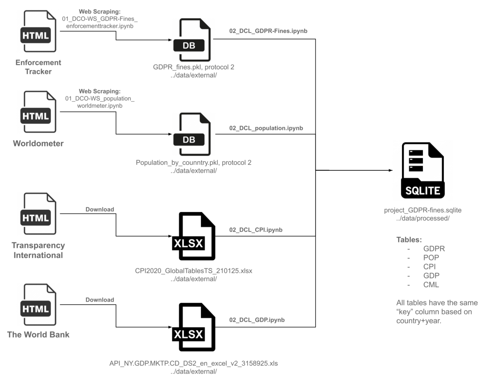

- [Analyzing GDRP Fines](#analyzing-gdrp-fines)
  - [1. Project Overview](#1-project-overview)
    - [1.1. Project Team](#11-project-team)
    - [1.2. Introduction and Objective](#12-introduction-and-objective)
  - [2. Datasets](#2-datasets)
    - [2.1. Primary Dataset](#21-primary-dataset)
      - [2.1.1. GDPR fines](#211-gdpr-fines)
    - [2.2. Secondary Datasets](#22-secondary-datasets)
      - [2.2.1. Population](#221-population)
      - [2.2.2. CPI Scores](#222-cpi-scores)
      - [2.2.3. GDP per capita](#223-gdp-per-capita)
  - [3. Project Structure](#3-project-structure)
  - [4. Workflow](#4-workflow)
  - [5. Cleaning and Manipulation](#5-cleaning-and-manipulation)
  - [6. Analysis](#6-analysis)
    - [6.1. Univariate EDA for Numerical Features](#61-univariate-eda-for-numerical-features)
    - [6.2. Bi-/Multivariate EDA](#62-bi-multivariate-eda)
  - [7. Ethical Considerations](#7-ethical-considerations)
  - [8. Installation and Setup](#8-installation-and-setup)
    - [8.1. Environment Setup](#81-environment-setup)
  - [9. Conclusion](#9-conclusion)


# Analyzing GDRP Fines

Analyzing GDPR fines imposed by the European data protection authorities could reveal the main 
reasons and focus areas of the authorities for non-compliance and could allow our organization 
to timely address similar gaps in their data privacy strategy.

## 1. Project Overview

### 1.1. Project Team

**UMICH MADS Milestone I Team**:

- **Andre Buser** (busera)
- **Victor Adafinoaiei** (vadafino)

### 1.2. Introduction and Objective
On May 25, 2018, the European Union (EU) “General Data Protection Regulation” (GDPR) became effective. The GDPR is a new data privacy initiative adopted by the EU to provide enhanced protection to EU citizens and their personal data. The penalties violations can result in up to twenty million euros or four percent of the company’s global annual revenue from the previous year, whichever number is higher. In addition, EU legislators impose fines for penalties to enforce data protection compliance.

The purpose of the project is to analyze GDPR fines that have been issued since 2018 and to get: 

- **Basic insights regarding**:
  - Which industry sectors have been penalized the most?
  - Which individual companies have been penalized the most?
  - Which EU countries have the most violations?
  - Which GDPR articles have been violated the most?
  - What are the “average costs” of a violation per sector?

- **Advanced insights** by correlating the GDPR fine dataset with the population by country (POP), gross domestic product (GDP), and corruption perception index (CPI) by country, the project intents to verify the following assumptions:
  - **A higher GDP** could lead to more reported cases, because a higher GDP could mean more companies in the country
  - **A higher CPI** could lead to more reported cases, because the public sector is maybe less influenced by the companies (higher CPI score = less corrupted)
  - **A higher population** could lead to more reported cases because more data subjects could execute their rights


## 2. Datasets
### 2.1. Primary Dataset
#### 2.1.1. GDPR fines
The GDPR fines data is the primary dataset. The information is scraped from the GDPR Enforcement Tracker website and contains details about the imposed GDPR fines. 

The information is scrapped with the Selenium library, because the GDPR information is dynamically loaded via Javascript and not available as a text in the html source code. The parsing process was written by the project team and is documented in the notebook: “01_DCO-WS_GDPR-Fines_enforcementtracker.ipynb”. 

| Column | dtype | atype | Rel. | Description |
|--------|-------|-------|------|-------------|
| ETid | str | O | No | Unique identifier assigned by the GDPR Enforcement Tracker |
| Country | str | N | Yes | Name of country |
| Date of Decision | str | O | Yes | Date when the fine was imposed |
| Fine [€] | int | Q | Yes | Amount of the fine in EUR |
| Controller/Processor | str | N | Yes | Data controller / processor / organization fined |
| Quoted Art. | str | N | Yes | Relevant GDPR article which was quoted for the imposed fine |
| Type | str | N | Yes | Reason/cause for the fine |
| Summary | str | N | Yes | Short explanation of the case |
| Authority | str | N | Yes | Name of the data protection authority who imposed the fine |
| Sector | str | N | Yes | Industry sector of the the controller/processor |


| Item | Source | Target |
|------|--------|--------|
| Access method | Web scraping (initial): Last scrap on 2021-11-28 | |
| Last update | | |
| Estimated size | | 926 records |
| No. of attributes | | 10 |
| Location | https://www.enforcementtracker.com/ | /data/external/ |
| Filename | Not applicable | gdpr_fines_enforcementtracker_p2.pkl |
| File format | HTML | Parsed: PKL |


> ⚠️ **Attention**: The initial parsing takes several hours, because for the detailed information (Summary, Authority and Sector) the page for every single case has to be opened and closed in sequence. The process also needs to be monitored due to potential timeout issues.

### 2.2. Secondary Datasets
#### 2.2.1. Population
Countries of the world with their population over the years (1955 - 2020). The data is scraped from the Worldometer website. 234 out of 235 countries were parsed. Micronesia was excluded due to parsing issues. For the parsing the Beautiful Soup library is used. The parsing code was written by the project team and is documented in the notebook: “01_DCO-WS_population_worldmeter.ipynb”.

| Column | dtype | atype | Rel. | Description |
|--------|-------|-------|------|-------------|
| Country | str | N | Yes | Name of the country |
| Year | int | O | Yes | Year of population |
| Population | int | Q | Yes | Amount of population |
| Yearly % Change | float | Q | No | Yearly change of the population |
| Urban Population | int | Q | No | Amount of urban population |


| Item | Source | Target |
|------|--------|--------|
| Access method | Web scraping (initial): Last scrap on 2021-11-28 | |
| Last update | N/A | |
| Estimated size | | 4212 (Micronesia excluded) |
| No. of attributes | | 5 |
| File location | https://www.worldometers.info/population/ | /data/external/ |
| Filename | Not applicable | population_by_country_p2.pkl |
| File format | HTML table | PKL |

> 🤝 **Decisions**: Micronesia was excluded due to parsing issues. Reasons for the parsing issues are related to the fact that Micronesia does not have all the data/columns compared to the other countries in the Worldmeter dataset. Considering that this country is not relevant for our analysis (no GDPR fines in Micronesia) the project team decided not to invest more time to cover this specific parsing case and decided to exclude the country.

#### 2.2.2. CPI Scores
The CPI dataset describes the Corruption Perceptions Index (CPI) per country. The CPI scores and ranks countries/territories based on how corrupt a country’s public sector is perceived to be. It is a composite index, a combination of surveys and assessments of corruption, collected by a variety of reputable institutions. 

The data is manually downloaded from the “Transparency International” website.

| Column | dtype | atype | Rel. | Description |
|--------|-------|-------|------|-------------|
| Country | str | N | Yes | Name of country |
| ISO3 | str | N | Yes | ISO code of the country name |
| CPI Score 20xx | int | Q | Yes | Corruption Perceptions Index (CPI) score of the year |

| Item | Source | Target |
|------|--------|--------|
| Access method | Download: Last download on 2021-11-29 | |
| Estimated size | 180 records | |
| No. of attributes | 34 | |
| File location | https://www.transparency.org/en/cpi/2020/index/ | /data/external/ |
| Filename | CPI2020_GlobalTablesTS_210125.xlsx | CPI2020_GlobalTablesTS_210125.xlsx |
| File format | XLSX | XLSX |

#### 2.2.3. GDP per capita
Gross Domestic Product (GDP) is the monetary value of all finished goods and services made within a country during a specific period. GDP provides an economic snapshot of a country, used to estimate the size of an economy and growth rate. 

This dataset contains the current GDP in USD, not corrected by the purchasing power parity (PPP) because we want to understand the overall amount of produced goods and services. The dataset is manually downloaded from the “The World Bank” website.

| Column | dtype | atype | Rel. | Description |
|--------|-------|-------|------|-------------|
| Country Name | str | N | Yes | Name of country |
| Country Code | str | N | Yes | ISO code of the country name |
| Indicator Name | str | N | No | All fields contain 'GDP (current US$)' value |
| Indicator Code | str | N | No | All fields contains 'NY.GDP.MKTP.CD' value |
| Columns of years (1960-2020) | float | Q | Yes | The GDP value of the year |


| Item | Source | Target |
|------|--------|--------|
| Access method | Download: Last download on 2021-11-29 | |
| Estimated size | 266 records | |
| No. of attributes | 65 | |
| File location | https://data.worldbank.org/indicator/NY.GDP.MKTP.CD | /data/external/ |
| Filename | API_NY.GDP.MKTP.CD_DS2_en_excel_v2_3158925.xls | API_NY.GDP.MKTP.CD_DS2_en_excel_v2_3158925.xls |
| File format | XLS | XLS |


## 3. Project Structure

    ├── README.md          <- The top-level README for developers using this project.
    ├── data
    │   ├── external       <- Data from third party sources.
    │   ├── interim        <- Intermediate data that has been transformed.
    │   ├── processed      <- The final, canonical data sets.
    │
    ├── notebooks          <- Jupyter notebooks. Naming convention is a number (for ordering),
    │                         the creator's initials, and a short `-` delimited description, e.g.
    │                         `01-data_load_and_cleaning`.
    │
    ├── reports            <- Generated analysis as HTML, PDF, LaTeX, etc.
    │   └── figures        <- Generated graphics and figures to be used in reporting
    │
	├── environment_conda.yml <- The requirements file for conda
    │               
    ├── environment_pip.txt   <- The requirements file for pip packages


## 4. Workflow
The project created, collectd, cleaned, manipulated and stored the datasets according to the following process flow:



> 🤝 **Decisions**: 
> - For all datasets (tables), the same unique key is created and used: country+year.
> - All cleaned datasets will be stored in the SQLite file “project_GDPR-fines.sqlite” for the following reasons:
>    - Retain data types and structure (compared to xlsx or csv)
>    - Improve access outside of Python, e.g. via an SQLite DB Browser


**Legend**
- WS: Web scraping
- DCO: Data collection
- DCL: Data cleaning and manipulation

## 5. Cleaning and Manipulation

**Joining Datasets**
The key attribute used to combine all datasets is the country name + year. Those attributes and values are present in all datasets.

**Main Challenges**
- Potential inconsistencies or spelling mistakes for the country naming 
- Missing values in the datasets
- Outliers in the datasets
- Breaking/melting “year columns” into rows

> 🤝 **Decision**: For cleaning or manipulation activities, an assert statement should be used to verify the expected outcome - where possible.


| Dataset | Processing Steps |
|---------|------------------|
| All datasets | • Lowercase column names<br>• Check consistencies in categorical features<br>• Create mapping table for country names + label encoding<br>• Ensure consistent country names via mapping table<br>• Create "key" column based on country+year for joining datasets<br>• Encode categorical features<br>• Drop unused columns<br>• Check for missing values<br>• Check for outliers |
| GDPR | • Lowercase column names<br>• Clean and tokenize summary column for NLP analysis<br>• Explode "quoted art." into separate columns<br>• Label-encode: country, controller/processor, quoted art., sector, company, type<br>• Extract year from date column<br>• Create unique key column: country+year<br>• Save result in SQLite DB-file |
| POP | • Lowercase column names<br>• Calculate population 2021 based on average growth rate<br>• Keep relevant columns: country, year<br>• Label-encode country<br>• Create unique key column: country+year<br>• Create and assign percentile column<br>• Keep only countries in GDPR-fine dataset<br>• Save result in SQLite DB-file |
| CPI | • Skip first 2 rows during import<br>• Lowercase column names<br>• Calculate CPI score 2021 based on average growth rate<br>• Keep relevant columns: country, CPI scores 2018-2021<br>• Rename columns to years only<br>• Melt 2018 to 2021 (single rows per year)<br>• Clean/check country names for consistency<br>• Keep only countries in GDPR-fine dataset<br>• Label-encode country<br>• Create unique key column: country+year<br>• Create and assign percentile column<br>• Save result in SQLite DB-file |
| GDP | • Skip first 3 rows during import<br>• Lowercase column names<br>• Calculate GDP 2021 based on average growth rate<br>• Keep relevant columns: country name, 2018-2021<br>• Melt 2018 to 2021 (single rows per year)<br>• Clean/check country names for consistency<br>• Keep only countries in GDPR-fine dataset<br>• Label-encode country<br>• Create unique key column: country+year<br>• Create and assign percentile column<br>• Save result in SQLite DB-file |

## 6. Analysis
In the analysis phase, the project team will combine numerical and visualization techniques to allow a better understanding of the different characteristics of the dataset, its features, and the potential relationships. For this EDA all datasets will be merged/joined into one dataframe. 

With the EDA we try to address and verify the following questions:
- What is the distribution of the various features to understand skewness, imbalances, and potential bias?
- Are outliers present?
- What are the relationships between the main features: GDPR fine, country, year, population, CPI, and GDP?
- How do the different pairs of features correlate with one other? Do these correlations make sense?

In the univariate EDA we intent to answer the following questions:
- Which individual companies have been penalized the most?
- Which EU countries have the most violations?
- Which industry sectors have the most violations?
- Which GDPR articles have been violated the most?
- What are the “expected average costs” of a violation per sector or article?

### 6.1. Univariate EDA for Numerical Features
For the numerical EDA the most commonly used descriptive statistics will be used as provided by pandas in the .describe() method. The method will provide calculations for count, mean, standard deviation, minimum, percentiles, and maximum. With the help of these numbers, relevant quantitative characteristics should be discovered.

| What | How (technique) | Why (learn from it) |
|------|-----------------|----------------------|
| Checking characteristics of all single numerical features. | • Histogram(s) with the pandas .hist() method<br>• Box Plots<br>• Bar Plots | To identify and understand the:<br>• Distribution / Skewness<br>• Outliers<br>• Variability |

### 6.2. Bi-/Multivariate EDA
Bivariate EDA techniques are used to explore pairs of variables and start understanding how they relate to each other. In the bi-/multivariate EDA we intent to explore the following assumptions:
- **A higher GDP** could lead to more reported cases, because a higher GDP could mean more companies in the country
- **A higher CPI** could lead to more reported cases, because the public sector is maybe less influenced by the companies (higher CPI score = less corrupted)
- **A higher population** could lead to more reported cases because more data subjects could execute their rights


| What | How (technique) | Why (learn from it) |
|------|-----------------|----------------------|
| Analyzing two or more numerical features | • Scatter plot / Seaborn pair-plot<br>• Pearson correlation coefficient<br><br>Note: correlation will be run against all features. | To explore the relationships between pairs of features:<br><br>Scatter plot:<br>• Overall pattern<br>• Strength/Noise<br>• Direction<br>  - Positive<br>  - Negative<br><br>Pearson:<br>• Strength<br>• Direction<br>  - Positive<br>  - Negative |
| Analyzing two or more categorical features | • Bar plots<br>• Cross-tables (optional)<br><br>Note: Correlation will be run against all features. | |
| Analyzing numerical and categorical features | • Box plots | To identify distributions and variations of numerical features, such as the GDPR fine, across categorical features, such as articles quoted, industry sector, ... |

## 7. Ethical Considerations
In order to assess for ethical concerns as part of the project, we have decided to use the Data Science Ethics Checklist embedded in the “Deon” library. The ethics checklist will be added to our data science project and notebooks and reviewed for relevance.
An initial assessment for potential ethical considerations is presented below:


| Topic | Relevant | Comments Project Team |
|-------|------|------------------------|
| A. Data Collection | | |
| A.1 Informed consent | No | Human subjects are not in the scope of the project. The information used such as GDPR related fines or country corruption index is publicly available information. |
| A.2 Collection bias | Yes | The GDPR related fines information publicly available is not the complete set of information. Certain fines are not made available for multiple reasons, such as ongoing broader investigations. As a result, the level of completeness of our analysis may be impacted. However, due to limited access to the information and time, we would not reach out to local privacy authorities for a more comprehensive view. We are planning to use analytics techniques to detect potential bias and find solutions to compensate for it. |
| A.3 Limit PII exposure | No | Personal identifiable information is not used in our analysis. Hence, anonymization or limiting data collection does not represent a risk. |
| A.4 Downstream bias mitigation | Yes | As for A.2, we will analyze bias both in the source data and the results to potentially compensate or mitigate any biased outcomes. |
| B. Data Storage | | |
| B.1 Data security | No | The project will use only publicly available information. Therefore, there is no need for data encryption or stringent access control to protect confidentiality. |
| B.2 Right to be forgotten | No | Individual data is not collected for this exercise. |
| B.3 Data retention plan | No | No requirements for data retention as the data used is made publicly available without any retention requirements. |
| C. Analysis | | |
| C.1 Missing perspectives | Yes | At this stage, we are not considering engaging with local privacy authorities to obtain a more nuanced view on the fines. Our analysis will purely rely on the information made available. However, we may reach out to our Data Privacy Office to explore more in-depth privacy needs. |
| C.2 Dataset bias | Yes | As part of the analysis phase, we are planning to test and take mitigation actions in case bias is detected. |
| C.3 Honest representation | Yes | The visualizations are designed having the following criteria: expressiveness and effectiveness. We want to ensure that visualization expresses all the facts in the set of data while conveying the information in an effective manner. |
| C.4 Privacy in analysis | No | PII (Personal Identifiable Information) is not considered nor collected as part of this project. |
| C.5 Auditability | Yes | The entire work will be documented in Jupyter Notebook to ensure that the work is reproducible. |
| D. Modeling | | Not applicable for this project |
| E. Deployment | | Not applicable for this project |

## 8. Installation and Setup

### 8.1. Environment Setup

We recommend using `conda` as the foundation because it simplifies the management of required Python versions.
To create the project's conda environment use:

```bash
conda env create -f environment_conda_.yml
```

Once the environment is created, activate it:

```bash
conda activate gdpr_fines
```

## 9. Conclusion

Our analysis of GDPR fines from 2018 to 2021 has revealed crucial insights for data protection practices, particularly in the healthcare sector. Spain emerged as the country with the highest number of fines across all industries. Our findings suggest that organizations should prioritize reviewing and strengthening their controls related to Information Security (Art. 32), Legal Basis for Data Processing (Art. 6 and Art. 9), and General Data Processing Principles (Art. 5), as these areas account for the majority of compliance issues and associated costs. We've also identified positive correlations between fine amounts and factors such as GDP, Corruption Perception Index (CPI), and population size. While our dataset has limitations in completeness, it provides valuable directional insights for improving GDPR compliance strategies. Future work will focus on refining our analysis with updated data, exploring additional variables, and developing predictive models to further enhance our understanding of GDPR enforcement trends.

The complete presentation can be accessed here: [Analyze GDPR Fines](https://github.com/busera/mads__analyze_gdpr_fines/blob/main/reports/Analyze_GDPR_Fines-Final_Report.pdf)